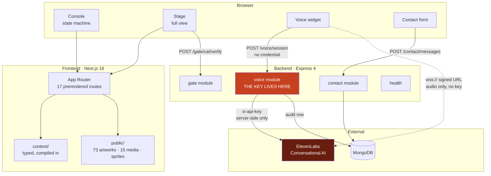
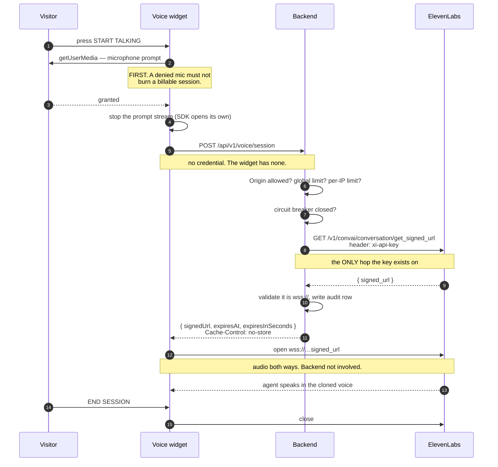
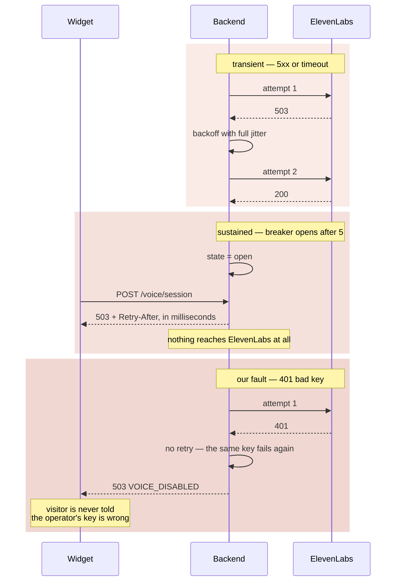
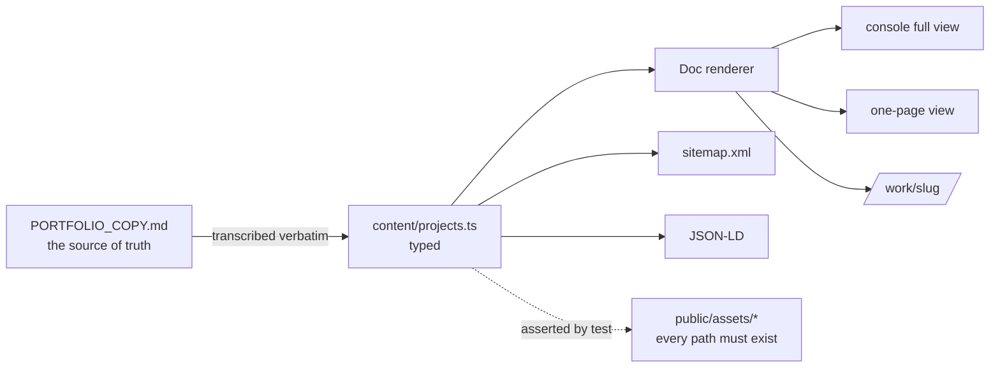
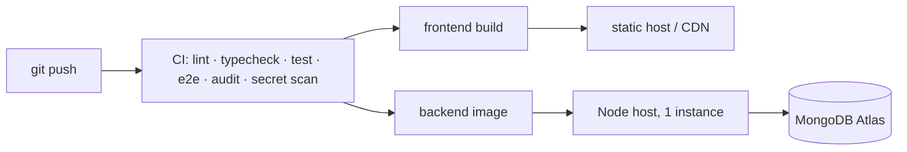

# Gate 2 — Solution Architecture

**Owner:** System Architect · **Status:** approved · **Date:** 2026-08-15

---

## 1. The shape of it



The dotted line is the point of the whole design: **audio goes browser →
ElevenLabs directly.** The backend brokers the handshake and then gets out of the
way — it is not in the media path, so it pays for no bandwidth and adds no
latency to the conversation.

---

## 2. Why a backend at all

The site is otherwise entirely static. The backend exists for exactly one
irreducible reason: **something has to hold the ElevenLabs API key, and it cannot
be the browser.**

The original build hit this wall and stopped. `BUILD_SPEC.md` §8a:

> Do not attempt to host the agent itself. It holds API keys client-side and
> publishing it would expose them.

Everything else the backend does — the contact form, the CAT gate check, the
audit ledger — is worth having but would not on its own justify a service. They
are there because the service is.

---

## 3. Sequence — a voice session



### Failure paths



---

## 4. Module boundaries

### Backend — clean layering, one direction

```
routes  →  controller  →  service  →  provider / model
   │           │             │              │
 HTTP       HTTP in,      business      the outside
 shape      HTTP out       logic          world
```

Nothing skips a layer, and nothing points back up. The consequences:

- `voice.service.js` has no Express in it and is testable without a server.
- `elevenlabs.provider.js` is the **only** file that reads `ELEVENLABS_API_KEY`.
  A provider swap is one file plus a config value, and touches no frontend code.
- Every route ends at the one error handler, so the response shape cannot drift.

### Frontend — one renderer, two routes in

Both ways into a project — the console's full view and the one-page scroll —
render through `components/blocks/Doc.tsx` and nothing else. The original build
made the same guarantee by sharing a function; here the type system enforces it.
The two can never show different things.

---

## 5. Data flow



Content is compiled into the frontend, so a page render touches no database and
no network. That is why the portfolio survives both dependencies being down.

---

## 6. API contract

Every response, success or failure, is one of two shapes:

```jsonc
// success
{ "ok": true,  "data": { … }, "meta": { "requestId": "…" } }

// failure
{ "ok": false, "error": { "code": "RATE_LIMITED", "message": "…" },
  "meta": { "requestId": "…" } }
```

`error.code` is a stable machine-readable string. The frontend switches on it and
never parses prose. Full contract: `docs/03-api.md`, machine-readable at
`/openapi.json`, and asserted by `tests/app.test.js`.

---

## 7. Observability

| Signal | Where | Notes |
|---|---|---|
| Structured logs | stdout, JSON via pino | Redaction list covers `signedUrl`, `xi-api-key`, `authorization`, `password` |
| Correlation ID | `x-request-id` on every request, response and log line | Inbound value honoured but character-filtered — it lands in log files |
| Liveness | `GET /health/live` | Touches no dependency. A liveness probe that checks Mongo restarts the API every hiccup |
| Readiness | `GET /health/ready` | Returns **200 with `status: degraded`** when a dependency is down — the site works without them, so pulling the instance would make a partial outage total |
| Counters | `GET /health/metrics` | Uptime, memory, circuit-breaker state, DB connection |
| Cost ledger | `voice_sessions` collection | One row per session: outcome, latency, hashed client. The answer to "why was the bill high" |

---

## 8. Scalability

| Concern | Position |
|---|---|
| Frontend | 17 static routes. A CDN serves them; scaling is not a question |
| Backend | Stateless apart from the rate limiter and the breaker. Horizontally scalable **once the limiter moves to Redis** — see below |
| Rate limiting | **In-memory, so per-process.** Correct for one instance. At N instances the limit silently becomes N× looser. Flagged in `docs/04-runbook.md` §8 |
| Circuit breaker | Per-process. Acceptable: each instance learns independently, and the wrong outcome is one extra failed call |
| Database | Not on the render path. Pooled at 10. Both collections carry TTL indexes |
| Media | 65 MB of artwork and video, immutable filenames, `max-age=31536000, immutable` |

---

## 9. Caching

| Layer | Policy | Why |
|---|---|---|
| HTML | Next default, revalidated | Static, cheap to re-fetch |
| `/assets/*`, `/sprites/*` | `public, max-age=31536000, immutable` | Content-addressed by filename; a changed artwork gets a new name |
| Fonts | Self-hosted by next/font, hashed | No third-party request, no layout shift |
| `POST /voice/session` | **`no-store`, always** | The body is a bearer token. A proxy caching it would hand one visitor's session to the next caller |
| API generally | `etag` disabled | Nothing here is cacheable and an ETag on a token is a bug |

---

## 10. Queues, storage, state

- **No queue.** Nothing here is long-running or fan-out. YAGNI.
- **No object storage.** 65 MB of media ships with the frontend and is served by the CDN.
- **No sessions, no cookies.** The API is stateless; there is nothing to log into.

---

## 11. Deployment



Frontend and backend deploy independently. The frontend is fully static, so a
frontend rollback is instant and cannot fail. Detail in `docs/04-runbook.md`.

---

## 12. Rollback

| Change | Rollback | Time |
|---|---|---|
| Frontend | Redeploy the previous static build | seconds |
| Backend | Redeploy the previous image | ~1 min |
| Voice provider misbehaving | Set `VOICE_PROVIDER=mock` and restart — the widget says so plainly and the screen recording still plays | ~1 min |
| Database schema | Additive only. Indexes rebuilt by `npm run seed`, which is idempotent | ~1 min |

No destructive migrations exist, so there is no rollback that can lose data.

---

## 13. Cost at architecture stage

| Item | Estimate |
|---|---|
| Frontend hosting | $0 — free tier is ample for a static site |
| Backend hosting | $0–7/mo — one small instance |
| MongoDB | $0 — free tier; the collections are tiny |
| ElevenLabs | Usage-based. **The variable, and the reason for two rate limits** |
| **Fixed total** | **under $10/month** |

The voice agent is the only unbounded cost, which is why the session endpoint has
both a per-IP and a global cap, and why every session is recorded.
